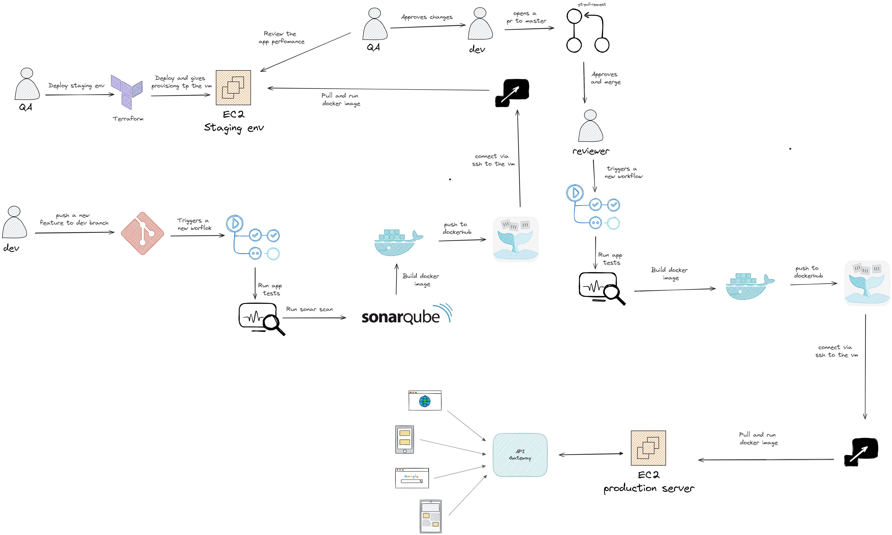

# CI CD IMPLEMENTATION 🚀

This is a simple example of how to implement a CI CD pipeline using Github actions, Docker, and GitHub.

## Prerequisites 🚨
- Terraform
- Docker
- GitHub account
- aws account

## CI CD architecture 🏗️

## Setup 🛠️

1. Run the terrafrom code located in the `moount_stagin` directory to create the necessary infrastructure on AWS.

2. Launch the sonarqube container using the docker-compose file located in the `sonar_qube` directory.

3. Set the value for the following secrets in the GitHub repository settings:

   - `DOCKER_PASSWORD` = password for docker hub
   - `DOCKER_USERNAME` = username for docker hub
   - `EC2_HOST` = public ip of the ec2 instance
   - `EC2_USERNAME` = username for the ec2 instance
   - `SONAR_HOST_URL` = public ip of the instance running sonarqube
   - `SONAR_TOKEN` = token for sonarqube
   - `SSH_PRIVATE_KEY` = this is generated by the terraform code and is used to connect to the ec2 instance

